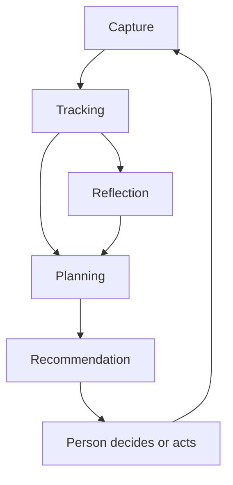

# Parallel You: Architectural Overview

## Purpose

Parallel You is a person-centred system for preserving continuity, supporting judgment, and making purposeful action easier under finite and variable human capacity.

It is not primarily a task manager, calendar optimizer, behavioural surveillance system, or autonomous life administrator.

The architecture is designed around one governing constraint:

> The system's representations, plans, recommendations, and optimization goals remain subordinate to the Person's agency.

This document gives new developers a compact map of the specification set. The individual specifications remain authoritative for detailed semantics and invariants.

## Architectural Shape

Parallel You separates its model into two layers:

1. **Domain concepts** describe the principal things the system represents.
2. **Capabilities** describe how the system receives, maintains, reasons about, and presents those representations.

This separation is deliberate. A Plan is a represented object; Planning is a process. An Activity is something the Person may do; Tracking is one way the system may maintain evidence concerning it.

## Core Domain Concepts

| Concept | Architectural role |
| --- | --- |
| **Person** | The human being served by Parallel You and the principal authority within the system. Distinct from every User, account, profile, device, and model. |
| **Time** | The temporal context for Intentions, Commitments, Activities, Events, Plans, and Observations. Includes uncertainty, availability, allocation, recurrence, transition, and buffers. |
| **Energy** | The Person's variable and Activity-dependent capacity to undertake and sustain Activity. Distinct from Time, Attention, Motivation, Mood, and Health. |
| **Attention** | The Person's variable capacity to orient, select, and sustain awareness. Includes switching, interruption, residue, momentum, fragmentation, and recovery. |
| **Intention** | Direction the Person presently wishes to preserve, pursue, explore, or bring about. It may remain ambiguous and need not become a Goal, Commitment, Activity, or Plan. |
| **Commitment** | An Intention to which the Person has attached, accepted, or acknowledged an obligation. Distinct from desire, Activity, Task, Plan, and Deadline. |
| **Activity** | Something the Person may do, is doing, or has done. Activity Definitions remain distinct from particular Activity Occurrences. Not every Activity is a Task. |
| **Plan** | A provisional representation of how Intentions or Commitments may be served under anticipated conditions. A Plan is not a command, prediction, Schedule, or record of what occurred. |

## Core Capabilities

| Capability | Architectural role |
| --- | --- |
| **Capture** | Receives, preserves, and provisionally interprets Expressions, Observations, imports, and other evidence. Preserves provenance and permits information before full classification. |
| **Tracking** | Maintains useful continuity concerning states, Events, Activities, Outcomes, and change over Time. Preserves current, historical, expected, derived, stale, and unknown states. |
| **Reflection** | Helps the Person examine experience and evidence to develop useful understanding. Distinguishes description, interpretation, Pattern, cause, attribution, and Insight. |
| **Planning** | Develops, evaluates, and revises possible courses of action under anticipated conditions. Produces Plans, alternatives, contingencies, or honest findings of infeasibility. |
| **Recommendation** | Selects and presents possible interpretations, choices, Plans, Activities, revisions, or responses for the Person's consideration. Does not decide or execute. |

## Typical Information Flow

The capabilities may form a loose cycle:

This is not a mandatory pipeline.

- Capture may support Planning directly.
- Reflection may end in understanding without action.
- Planning may produce no Recommendation.
- Recommendation may propose non-action, rest, clarification, or Reflection.
- The Person may act without a recorded Plan or Recommendation.

Implementations should avoid hard-coding the diagram as a required workflow.

## Authority Flow

Parallel You distinguishes several transitions that conventional productivity software often collapses:

| Transition | Meaning |
| --- | --- |
| **Expression → Capture** | Information was communicated or obtained; it was not necessarily declared as fact or intent. |
| **Capture → Representation** | The system created or updated a model; the model is not reality. |
| **Planning → Plan** | A possible course was represented; it was not necessarily accepted. |
| **Plan → Recommendation** | A Plan was selected for consideration; it was not adopted. |
| **Recommendation → Acceptance** | The Person adopted some proposal within a scope and Context. |
| **Acceptance → Authorization** | The Person granted authority for a defined action; acceptance alone may not be sufficient. |
| **Authorization → Execution** | An action was performed within delegated scope. |
| **Execution → Observation** | Evidence indicates something occurred; it does not establish intention, attention, or Outcome by itself. |

Never infer a later transition solely from an earlier one.

Authentication establishes operational identity. It does not establish unlimited authority to act for the Person.

### Account-to-Person deployment invariant

Parallel You `v0.1` is deployed on the invariant that each authenticated account represents one human actor. On first successful authentication, the application creates an independent Person identifier and preserves an authority-scoped association between the operational identity and that Person.

The one-actor-per-account constraint does not make the account, session, credential, or identity provider subject equivalent to the Person. Authentication identity and Person identity retain distinct identifiers and lifecycles. Supporting delegates, agents, shared accounts, or several Persons behind one account requires an explicit relationship and authority model beyond this deployment invariant.

## Representation Doctrine

Every important representation should preserve enough metadata to answer:

- What is being represented?
- Which Person, Context, and Time does it concern?
- Where did the information come from?
- Was it declared, observed, imported, inferred, assumed, forecast, or confirmed?
- How certain and current is it?
- Which transformations or interpretations were introduced?
- Under what authority may it be used or acted upon?

Unknown, ambiguous, stale, disputed, and conditional states are legitimate. Do not replace them with convenient defaults that appear factual.

## Capacity Model

Capacity is not a single quantity.

At minimum, Planning and Recommendation must keep these distinctions visible:

- available Time is not available Energy;
- available Energy is not available Attention;
- capacity for one Activity is not capacity for another;
- capacity to perform is not proof of sustainability;
- available capacity is not necessarily expendable capacity;
- unallocated Time is not necessarily available Time;
- reserve, recovery, transitions, buffers, and ordinary life are legitimate uses of capacity.

An implementation that fills every open Calendar Interval or consumes every estimated reserve violates the architecture even if its scheduling algorithm is technically correct.

## Temporal Model

Instants, Intervals, Durations, availability, allocations, schedules, deadlines, transitions, buffers, and recurrence are distinct.

Key implementation cautions:

- scheduled Activity is not observed Activity;
- estimated Duration is not observed Duration;
- record creation Time is not necessarily occurrence or effective Time;
- calendar arithmetic is not fixed-duration arithmetic;
- recurrence definitions remain distinct from individual Occurrences;
- changing future recurrence must not rewrite historical Occurrences;
- missed recurring Occurrences do not automatically become debt.

Preserve time zone, calendar, and uncertainty information where interpretation depends upon them.

## State and History

Tracking distinguishes:

- current state;
- historical state;
- expected state;
- derived state;
- stale state;
- disputed state;
- and unknown state.

The latest record is not necessarily current. Silence does not prove continuity. Expiration does not prove the opposite state. A gap must not be silently interpolated.

History may inform assistance but must not define the Person's identity, values, capabilities, or destiny.

## Human Agency and Non-Moralization

Parallel You treats rejection, revision, deferral, interruption, deviation, abandonment, rest, and non-action as legitimate states or choices.

Do not encode moral judgment into operational language or ranking.

In particular:

- incomplete does not mean failed;
- deviation does not mean disobedience;
- low Energy does not mean laziness;
- difficulty attending does not mean lack of care;
- missed recurrence does not create moral debt;
- stopping does not necessarily mean completing or abandoning;
- acceptance and adherence are not universal measures of quality;
- emotional expression is not automatically a request for optimization.

## Burden Budget

Every capability has a burden:

- Capture Burden;
- Tracking Burden;
- Reflection Burden;
- Planning Burden;
- Recommendation Burden.

Burden includes Time, Energy, Attention, interruption, emotional effort, privacy exposure, and administrative work.

The architecture requires that burden remain proportional to expected support. A feature that improves model completeness while making the Person do more work may be architecturally negative.

Prefer progressive detail, selective clarification, honest unknowns, reversible defaults, and quiet suppression of low-value prompts.

## Privacy and Delegation

Authority is purpose-bound and capability-specific.

Access to information does not automatically authorize:

- durable retention;
- cross-context combination;
- sensitive inference;
- Reflection;
- Recommendation;
- disclosure;
- notification;
- or external action.

Likewise, authority to Plan does not imply authority to schedule or execute. Authority to recommend does not imply authority to decide.

Delegation must remain scoped, inspectable, restrictable, and revocable. Prefer reversible administrative action when it adequately serves the Person.

## Implementation Heuristics

When adding a feature or service, ask:

1. Which domain concepts does it read or write?
2. Which capability is it implementing?
3. What provenance, Time, Context, confidence, and authority must it preserve?
4. Which distinctions could it accidentally collapse?
5. What burden does it impose on the Person?
6. What happens when information is missing, stale, contradictory, or wrong?
7. What can the Person inspect, correct, reject, restrict, or revoke?
8. Does it preserve reserve and future choice, or merely maximize apparent utilization?

If the feature cannot answer these questions, it is not ready to become part of Parallel You.

## Specification Index

### Domain concepts

- `person.md`
- `time.md`
- `energy.md`
- `attention.md`
- `intention.md`
- `commitment.md`
- `activity.md`
- `plan.md`

### Capabilities

- `capture.md`
- `tracking.md`
- `reflection.md`
- `planning.md`
- `recommendation.md`

Start with this overview, then read the specification governing the feature being changed and every concept it materially reads or writes. The invariants at the end of each specification are the fastest reliable implementation checklist.
